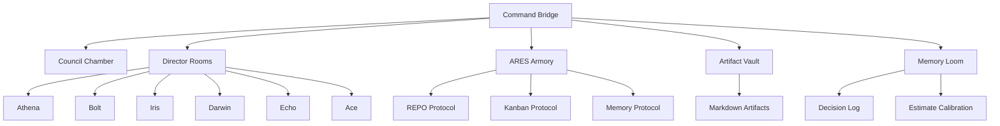
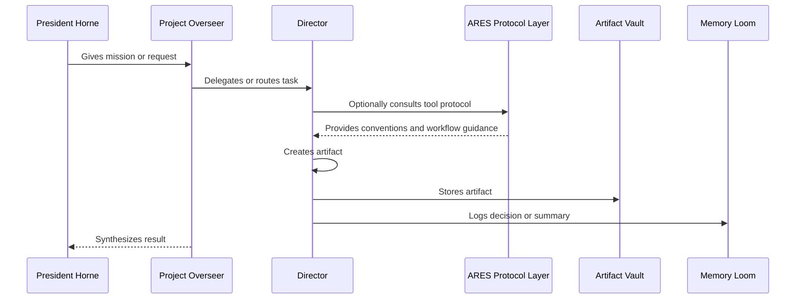
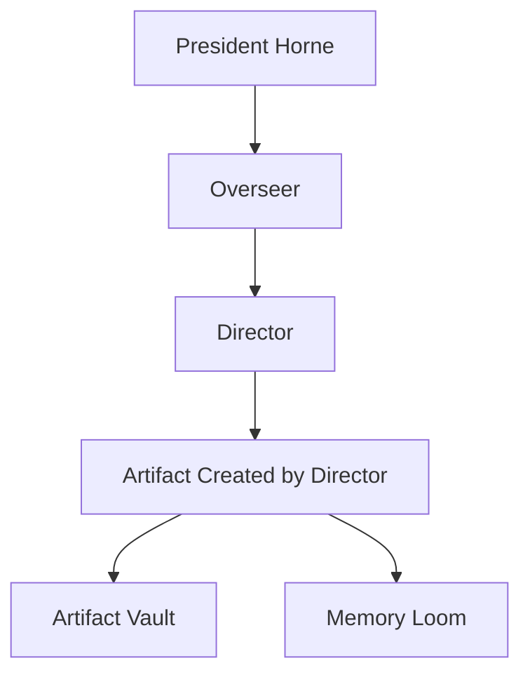
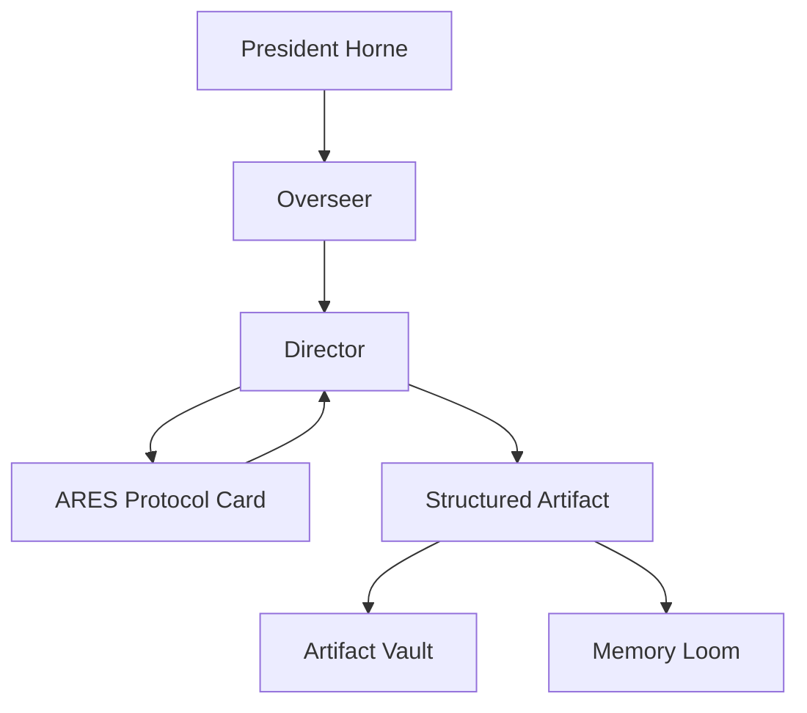
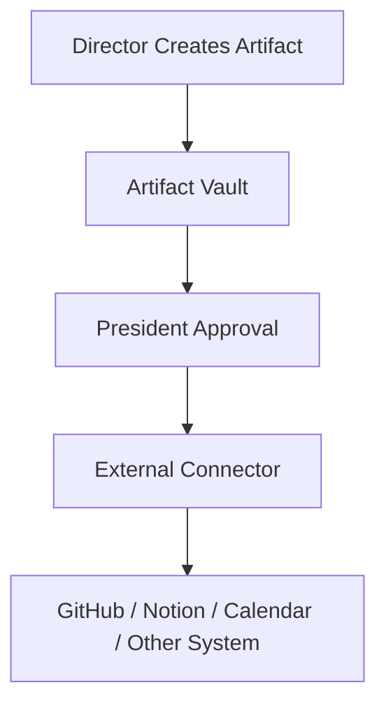

# Project Overseer Architecture Overview

## Purpose

This document defines the first practical architecture for Project Overseer.

Project Overseer is a multi-agent command workstation where President Horne works with a specialized THINKTANK of Directors to produce durable artifacts, plans, documents, prototypes, systems, and ventures.

The architecture must support:

* rich Director personalities
* command-centered interaction
* artifact creation and storage
* ARES tool protocols
* project memory
* markdown-first documentation
* future AI agent integration
* future local and cloud execution paths
* strong visual identity
* low dependency bloat
* disciplined context usage

The first version should be simple enough to build quickly while preserving the long-term platform vision.

## Architectural North Star

The first version should prove this core loop:

> President Horne gives direction.
> Overseer coordinates.
> A Director contributes expertise.
> The Director creates an artifact.
> ARES provides tool protocol support when useful.
> The artifact is stored.
> The system remembers what happened.

This loop matters more than premature autonomy.

## System Layers

Project Overseer is organized into six primary layers.

```text
1. Command Interface
2. Overseer Coordination Layer
3. Director Layer
4. ARES Protocol Layer
5. Artifact Layer
6. Memory Layer
```

### 1. Command Interface

The user-facing workstation.

Includes:

* Command Bridge
* Council Chamber
* Director Rooms
* ARES Armory
* Artifact Vault
* Memory Loom

The Command Interface should feel like a tactical AI command console, not a generic dashboard.

### 2. Overseer Coordination Layer

Project Overseer coordinates work.

Responsibilities:

* interpret President Horne’s intent
* select or address relevant Directors
* manage workflow modes
* track open directives
* synthesize outputs
* guide artifact creation
* decide when ARES protocols are useful
* maintain project continuity

Overseer is the command coordinator, not the sole author of all work.

### 3. Director Layer

Directors are the specialist members of the THINKTANK.

Directors include:

* Athena
* Bolt
* Iris
* Darwin
* Echo
* Ace

Each Director should have:

* distinct identity
* department
* voice
* expertise
* preferences
* reporting style
* preferred artifacts
* preferred ARES tools or protocols

Directors create content and artifacts.

### 4. ARES Protocol Layer

ARES is the armory and protocol layer.

ARES provides:

* tool descriptions
* tool usage rules
* toolchains
* process guidance
* syntax examples
* protocol cards
* future connector mappings

ARES is not an autonomous agent.

ARES does not replace Director authorship.

ARES supports Directors when they use structured tools.

Example:

* Bolt writes a README.
* REPO provides repository conventions.
* ARES stores or exposes the REPO protocol.
* A future GitHub connector may commit the README after approval.

### 5. Artifact Layer

Artifacts are durable outputs produced by the system.

Examples:

* markdown documents
* READMEs
* architecture notes
* diagrams
* prompt files
* decision logs
* roadmaps
* UI specs
* research briefs
* implementation plans
* generated code files

The Artifact Vault is the primary interface for inspecting these outputs.

### 6. Memory Layer

Memory preserves continuity.

Early memory should be simple and inspectable.

Initial memory structures:

* decision log
* estimate calibration log
* prompt log
* artifact index
* session summaries
* open questions
* project state notes

Advanced memory systems such as vector databases or graph databases should be added only when the simpler memory layer becomes insufficient.

## First Implementation Shape

The first implementation should be frontend-first and markdown-first.

Recommended initial stack:

```text
Frontend:
- Vite
- React
- TypeScript
- Tailwind CSS

Documentation:
- Markdown files

Initial Data:
- Static mock data in TypeScript files or JSON

Persistence:
- Local repo files first
- Later: local API or file-backed storage

Backend:
- Not required for the first shell
- Later candidate: Python FastAPI
```

The first shell can use mock data. The priority is to establish structure, visual direction, and product behavior.

## Initial Repository Structure

Recommended starter structure:

```text
project-overseer/
  AGENTS.md
  README.md

  docs/
    00_manifesto.md
    01_product_vision.md
    02_architecture_overview.md
    03_ui_design_bible.md
    04_ares_protocol.md
    05_director_model.md
    06_memory_strategy.md
    07_implementation_roadmap.md
    08_inspirations.md
    09_open_questions.md

  docs/meta/
    decision_log.md
    estimate_calibration_log.md
    prompt_log.md

  directors/
    overseer.md
    athena.md
    bolt.md
    iris.md
    darwin.md
    echo.md
    ace.md

  diagrams/
    system_v0.mmd
    director_artifact_flow.mmd
    app_navigation_v0.mmd
    roadmap_v0.mmd

  prompts/
    00_codex_bootstrap.md
    01_build_shell.md
    02_review_shell.md

  apps/
    web/
```

This structure may evolve, but the first repo should remain readable.

## First UI Architecture

The first UI should include six navigable rooms.



## Correct ARES Relationship

ARES supports Directors. ARES does not author in their place.



## Director-Only Artifact Path

Directors should be able to create artifacts without ARES.



## Director + ARES Artifact Path

ARES improves structure when a tool protocol is relevant.



## Future Connector Path

External connectors should come later.



## Context Discipline

The system should avoid loading every file for every task.

Use relevant context only.

Examples:

* UI task: read Product Vision and UI Design Bible.
* Director behavior task: read Director Model and relevant Director file.
* ARES task: read ARES Protocol.
* Roadmap task: read Implementation Roadmap and Estimate Calibration Log.

The principle:

> Do not load the library. Load the page.

## Build Philosophy

Start with:

* navigable shell
* strong visual identity
* mock Director data
* mock ARES protocol cards
* mock artifacts
* mock memory entries

Then add:

* artifact creation
* artifact saving
* Director-authored outputs
* ARES-assisted outputs
* memory logging
* Codex-assisted implementation loop

Then consider:

* backend
* file persistence
* local agents
* MCP integrations
* GitHub connector
* Notion connector
* vector memory
* graph memory

## Architecture Priorities

The architecture should prioritize:

1. clarity
2. personality preservation
3. artifact production
4. low dependency bloat
5. inspectable files
6. beautiful interface
7. context discipline
8. incremental implementation
9. future extensibility
10. President Horne’s command experience

## First Successful Demo

The first successful demo should show:

1. Command Bridge opens.
2. Director Rooms are navigable.
3. ARES Armory shows tool protocols.
4. Artifact Vault shows mock artifacts.
5. Memory Loom shows mock decisions and session notes.
6. The interface feels visually distinct.
7. The product concept is immediately understandable.

The first functional demo should show:

1. President Horne selects Bolt.
2. Bolt creates a README artifact.
3. The artifact is stored in Artifact Vault.
4. A decision or action is logged in Memory Loom.
5. ARES REPO protocol can optionally guide the README structure.
